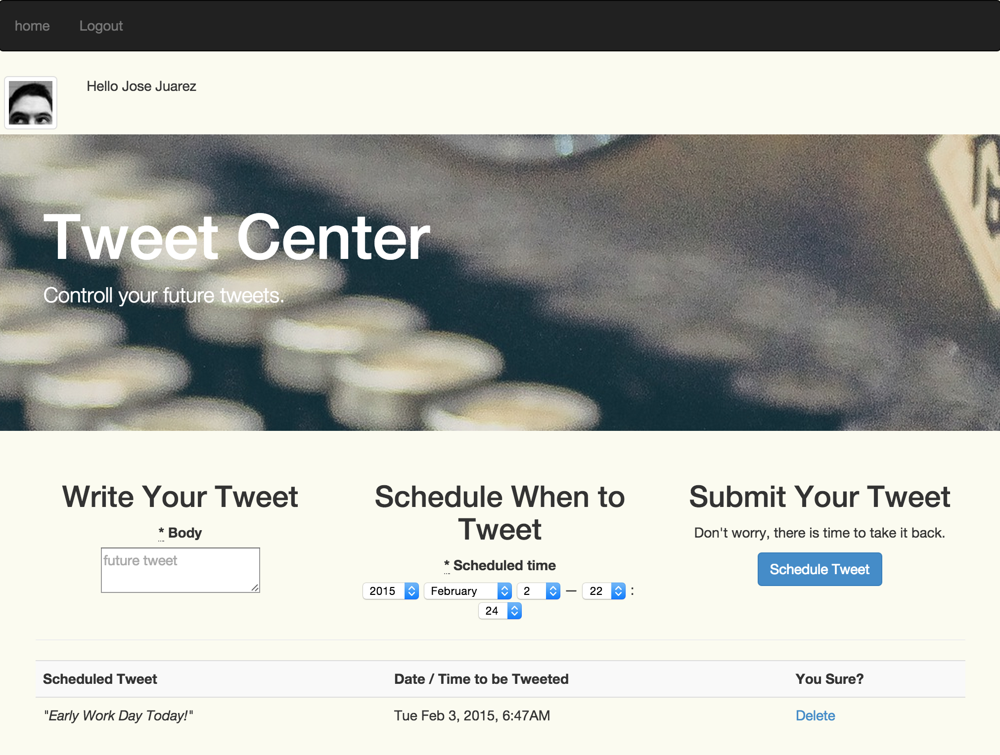

# Tweet You Later

Login, setup a tweet and time... go to bed.

Tweet You Later allows you to schedule tweets for a future time / date.

## Demo
See a semi functional <a href="https://tyl2.herokuapp.com/" target="_blank">Live Demo</a>. To get a fully functional copy clone and setup a copy locally or on a server.

## Setup Your Own
You can setup and run a copy on your local system or server:
1. Clone git repo.
2. You will need a copy of the <a href="http://redis.io/" target="_blank">redis</a> database t use with sidekiq.
3. You will need to setup a config/application.yml file. See [config/application.example.yml](config/application.example.yml) for an example of what you need to setup.
4. You are going to need to register a twitter application in order to get twitter user authentication working.

## License
Do as you like, I have released Tweet You Later under the MIT License, just make sure you give me credit. I am not responsible for anything you do with this code. If you end up making a ot of money you are free to cut me a check (or a high paying job). View the [Licnese File](MIT-LICENSE).